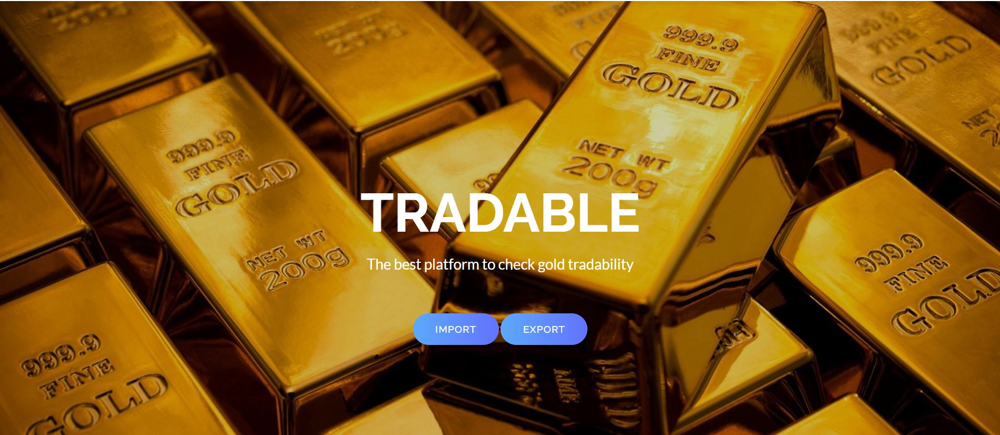

#  🪙🥇  Tradable 🥇💰

## 🥇 The best Blockchain based platform to check gold tradability. 📃

## Survey

In recent years, gold smuggling has increased a lot and causing huge loss to government.

## Problem Statement
According to this [report](https://tinyurl.com/goldtrack1), Gold is often smuggled from locations where it is cheaper due to lower taxes to high demand countries like India to earn quick bucks by resale. Canada-based group IMPACT found in one of its reports that nearly 25 percent of all gold coming into India comes by illegal smuggling which is about 200 to 225 tonnes.

Accoring to this [report](https://tinyurl.com/goldtrack2) , 11,000 kg of gold seized over 5 years in India.

## Solution
Just ask one question, what if we don't give legal tender to this smuggled gold?
Sounds interesting? This is what my idea is.
Tradable is Blockchain based scalable solution. It uses QR-code based verification, complete import/export process tracking and no legal tender to smuggled gold.

## Proposed Methodology
1) Initially, the exporter exports the gold by entering details like production ID, quantity, source and destination country, exporting license and bill amount. The details are encrypted using strong AES algorithm and encoded into QR code.

2) This QR code will be printed on each gold bars or production lots and will also be stored to Filecoin Storage to prevent tampering.

3) Now, when the gold reaches importer, it will first verify the QR printed on gold bar or production lot with the QR  code stored on Filecoin Decentralized Storage. Now, importer will enter the details of the gold actually received. This will get compared to exporter's details.

4) If they are same, then importer will approve gold for trade in country otherwise that gold won't be legal tender so no value of that gold. So, clearly no point of smuggling.

5) Now, consumer companies or distributors even will get verification status of imported gold using ID.

6) Hence, only verified imported gold will be traded in country

### Contract on Polygon Mumbai Testnet

[0x725413dceCcFd3d7a7743061aB090DCE6D124f05](https://mumbai.polygonscan.com/address/0x725413dceCcFd3d7a7743061aB090DCE6D124f05)

### Steps to Run

1) Clone this repository

2) Run 'npm install ' in main folder to install node modules.

3) Setup Metamask and truffle config according to your testnet.

4) Run 'npm start' in main folder and check landing page at http://localhost:3000

### Video Demo

